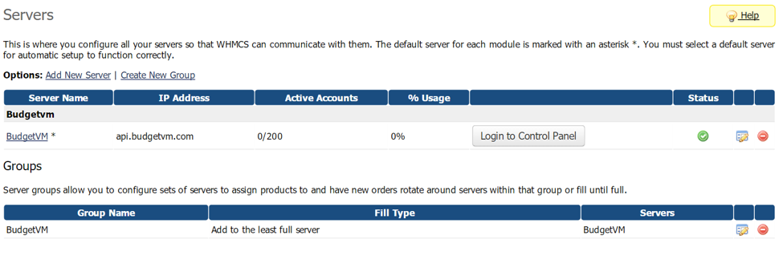
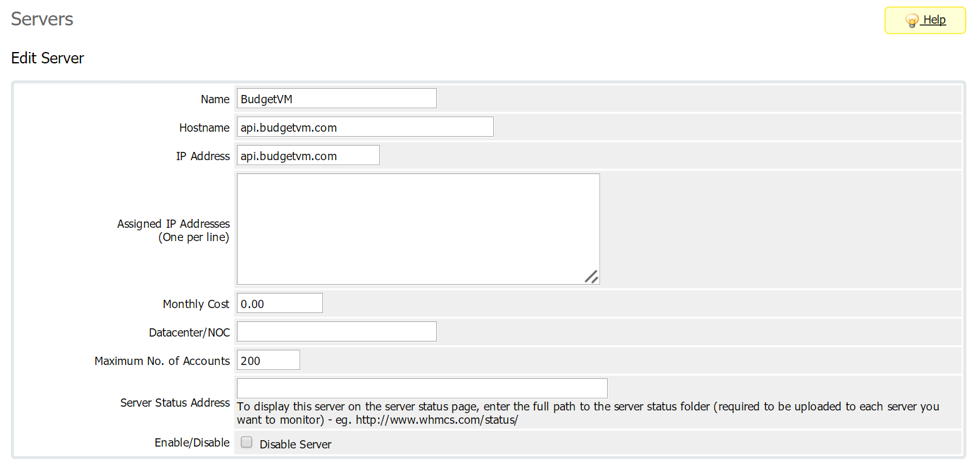
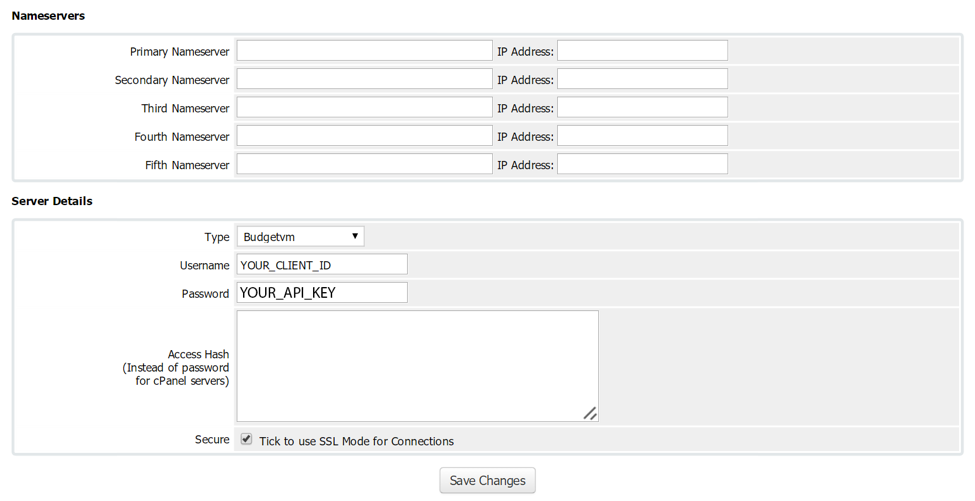
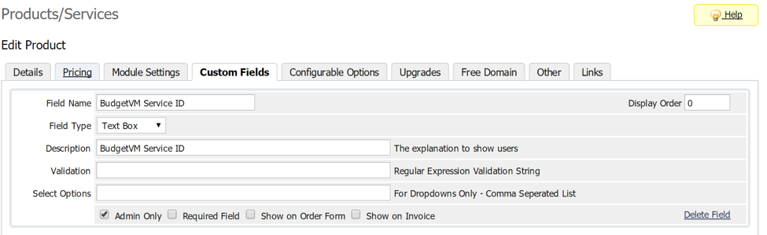

# budgetvm-whmcs
* Downloadable Documentation
 * [Word Installation Guide .docx](docs/install_guide.docx)
 * [Word Installation Guide .pdf](docs/install_guide.pdf)
* WHMCS Version 5.x
 * /v5/
* WHMCS Version 6.x
 * /v6/
* Create a Server named “BudgetVM”
 * Name: BudgetVM
 * Hostname: api.budgetvm.com
 * IP Address: api.budgetvm.com
 * Type: Budgetvm
 * Username: {Your_BudgetVM_Client_ID}
 * Password: {Your_BudgetVM_API_KEY}
* Create a Server Group named “BudgetVM”
 * Add the server we created named “BudgetVM” to the BudgetVM Server Group
* Add a custom field to the service in your WHMCS named “BudgetVM Service ID” that is Admin Only
* Goto the product in your clients profile and enter the associated BudgetVM Service ID in the Field called “BudgetVM Service ID”

